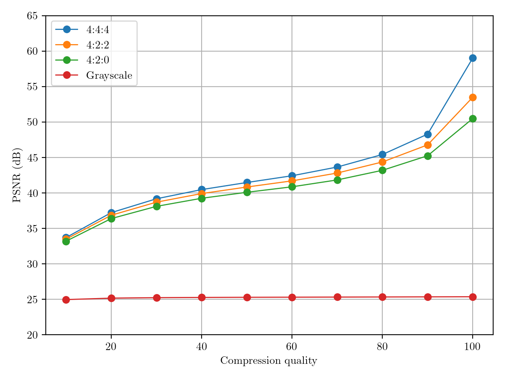

# JPEG Encoder/Decoder

## Features
- Baseline sequential DCT JPEG (Mode 0)
- Extended sequential DCT JPEG (Mode 1)
- Lossless JPEG (Mode 2)
- Progressive DCT JPEG (Mode 3)
- 8-bit and 12-bit precision
- Adaptive Huffman tables
- Chroma subsampling ratios: 444, 422, 420

## References
- ITU-T T.81
- ITU-T T.871
- libjpeg

## Preview
### 1. Baseline sequential DCT - Subsampling ratio 420 - 8-bit
<table>
  <tr>
    <th>Quality 10</th>
    <th>Quality 50</th>
  </tr>
  <tr>
    <td></td>
    <td></td>
  <tr>
    <th>Quality 90</th>
    <th>Quality 100</th>
  </tr>
  <tr>
    <td></td>
    <td></td>
  </tr>
</table>

### 2. Progressive DCT - Subsampling ratio 420 - 8-bit
<table>
  <tr>
    <th>DC coefficients only</th>
    <th>DC coefficients & First 2 luminance AC coefficients</th>
  </tr>
  <tr>
    <td></td>
    <td></td>
  </tr>
  <tr>
    <th>DC coefficients & All luminance AC coefficients</th>
    <th>Complete reconstruction</th>
  </tr>
  <tr>
    <td></td>
    <td></td>
  </tr>
</table>

### 3. Chrominance subsampling comparison

